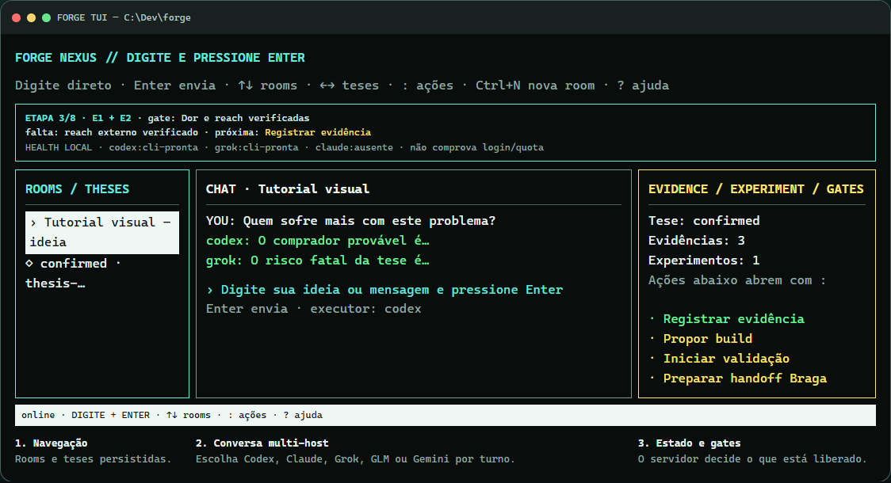
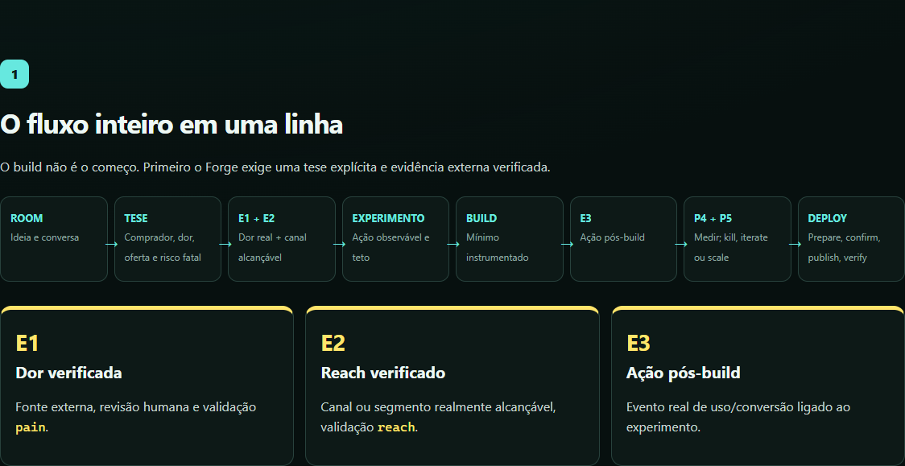
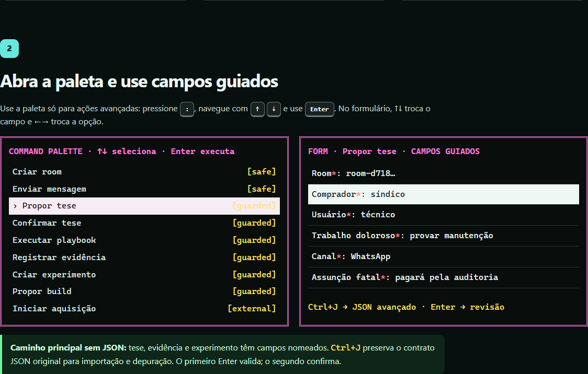
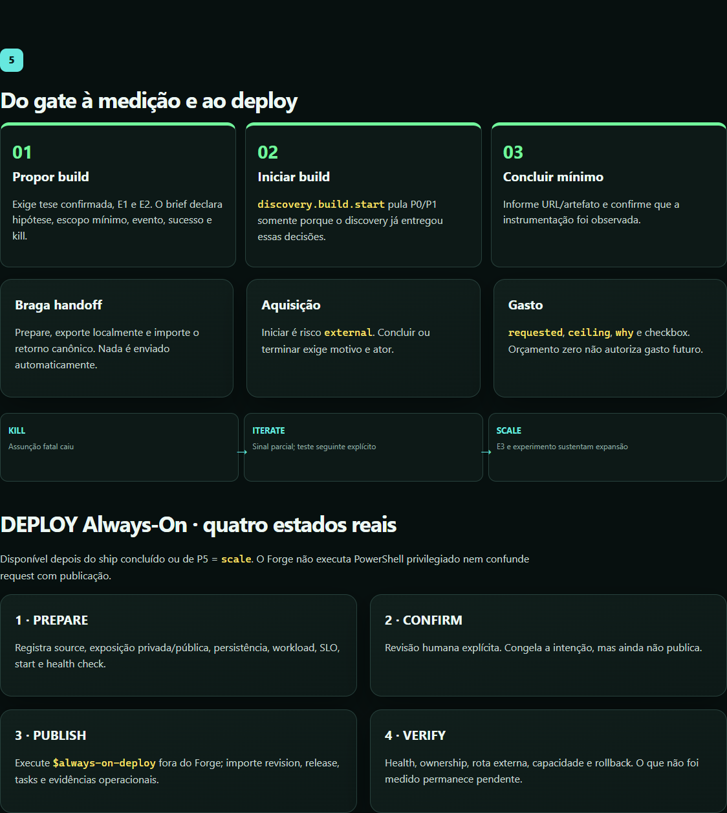

# Tutorial visual — Forge discovery-first

O fluxo atual é **room → tese → E1/E2 → experimento → build → E3/aquisição → P4/P5 → DEPLOY Always-On**.

Abra também a versão navegável: [`TUTORIAL-VISUAL-DISCOVERY-FIRST.html`](TUTORIAL-VISUAL-DISCOVERY-FIRST.html).



## Primeira ideia em 90 segundos

1. Em qualquer PowerShell ou CMD, execute:

   ```powershell
   forgenexus
   ```

2. Quando a TUI abrir, **digite sua ideia diretamente** no prompt central.
3. Pressione `Enter`. Se ainda não existir uma room, o Forge cria uma automaticamente e envia a mesma mensagem com o Codex.

Deu certo quando a room aparece à esquerda, sua mensagem aparece no chat e a faixa **ETAPA 2/8 · TESE** mostra a próxima ação.

`forgenexus` é o caminho principal: localiza `C:\Dev\forge`, inicia/reutiliza o Maestro, atualiza automaticamente um processo local obsoleto, espera o health e abre a TUI. Os comandos `npm` manuais ficam somente em [Solução de problemas](#solução-de-problemas).

## A faixa “Você está aqui”

Ela permanece no topo e mostra:

- etapa atual e gate;
- requisito que ainda falta;
- próxima ação do catálogo;
- health local das CLIs (`cli-pronta` ou `ausente`).

`cli-pronta` comprova apenas que a CLI está instalada. Não comprova login, quota ou capacidade do provider.



## Paleta e formulários guiados

Pressione `:`. Use `↑`/`↓` para selecionar e `Enter` para abrir. No formulário, `↑`/`↓` troca o campo, `←`/`→` troca a opção e `Enter` avança; no último campo, ele abre a revisão. Outro `Enter` confirma e `Esc` volta.



Tese, evidência e experimento agora usam campos nomeados. Room, tese, ator, data e IDs conhecidos são preenchidos automaticamente quando disponíveis.

### Tese

Preencha comprador, usuário, trabalho doloroso, alternativa atual, segmento alcançável, canal, assunção fatal e oferta. Depois use **Confirmar tese**; essa promoção continua humana.

### Evidência

Preencha observação, inferência, o que valida (`pain`, `reach`, `action`, `economic` ou `channel_metric`), polaridade, fonte, data, sensibilidade e se é sintética. Depois use **Verificar evidência**.

- **E1:** dor externa verificada (`pain`).
- **E2:** segmento/canal alcançável verificado (`reach`).
- **E3:** ação real pós-build ligada ao experimento (`action`).

Evidência sintética e simulações não abrem os gates.

### Experimento

Preencha hipótese, método, público, ação esperada, critérios de sucesso e kill, janela e teto de custo. First Customer Finder pode preparar shortlist e abertura, mas não envia outreach.

### JSON avançado

Nos três formulários guiados, pressione `Ctrl+J` para alternar para o contrato JSON original. Use isso para importação ou depuração, não como caminho principal.

## Build, medida e decisão



1. **Propor build** — exige tese confirmada + E1 + E2.
2. **Iniciar build aprovado** — cria a pipeline sem repetir discovery.
3. **Concluir build mínimo** — registra URL/artefato e instrumentação observada.
4. **Iniciar aquisição** — ação externa com confirmação e término explícito.
5. **Registrar medição P4** — grava números reais comparáveis.
6. **Decidir P5** — `kill`, `iterate` ou `scale`.

## DEPLOY Always-On

O deploy aparece como a etapa 8/8 depois do ship concluído ou de uma decisão P5 `scale`. Ele não executa PowerShell privilegiado dentro do Forge:

1. **PREPARE** — origem, exposição, persistência, workload, SLO e health check.
2. **CONFIRM** — revisão humana explícita; ainda não publica.
3. **PUBLISH** — execute `$always-on-deploy` fora do Forge e importe revision, release, tasks e evidências.
4. **VERIFY** — registre health local/externo, ownership, capacidade e rollback. Itens não medidos permanecem visivelmente pendentes.

O Forge nunca marca publicação só porque o request foi criado.

## Teclas

| Tecla | Ação |
|---|---|
| Digitar | Escrever imediatamente no prompt principal |
| `Enter` | Enviar a mensagem; na primeira vez, criar a room automaticamente |
| `:` | Abrir a paleta |
| `Ctrl+N` | Abrir o formulário de nova room |
| `?` | Mostrar/ocultar ajuda curta |
| `↑` / `↓` | Trocar room; na paleta/formulário, trocar item ou campo |
| `←` / `→` | Trocar tese; no formulário, trocar opção |
| `Ctrl+U` | Limpar o prompt |
| `Ctrl+J` | Alternar campos guiados / JSON avançado |
| `Esc` | Limpar o prompt, voltar ou cancelar |
| `Ctrl+C` | Sair |

Não clique nos painéis: a TUI é keyboard-first. Você também não precisa usar `Tab`; digite e pressione `Enter` como no Codex ou Claude Code.

## Solução de problemas

Use estes comandos somente se `forgenexus` falhar.

```powershell
cd C:\Dev\forge
npm install            # somente se node_modules não existir
npm run maestro        # terminal 1
npm run tui            # terminal 2
```

- `ENOENT ... maestro/.token`: o Maestro não iniciou; rode `npm run maestro` e mantenha o terminal aberto.
- Porta `8799` ocupada: verifique `http://127.0.0.1:8799/api/health` antes de iniciar outra instância.
- PowerShell bloqueou `npx.ps1`: use wrappers `.cmd`; `forgenexus` já usa `npm.cmd` no Windows.

O Control Center web continua em `http://127.0.0.1:8799`. O tutorial documenta o fluxo; ele não executa agente, outreach, gasto ou deploy real.
