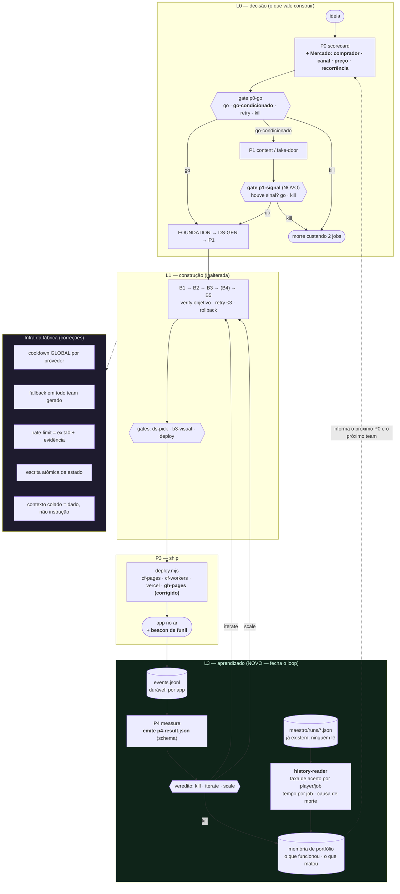

# 02 — Arquitetura-alvo

> O ForgeMMR não precisa de outra arquitetura. Precisa de **quatro coisas que ele não tem** e de
> **quatro que ele tem e não funcionam**. Este documento diz quais, e o que fica exatamente como está.

---

## 1. Princípios (herdados e mantidos)

Estes quatro princípios já são impostos por mecanismo, não por conselho. **Não mexer.**

| Princípio | Mecanismo atual | Veredito |
|---|---|---|
| Nunca API paga por chamada como motor de agente | Só `spawn` de CLI de assinatura; não existe client HTTP de LLM no repo | **Preservar** |
| Kill antes de construir | P0 roda antes de qualquer código e termina em gate `go/retry/kill` | **Preservar o mecanismo, corrigir a pergunta** (F-07) |
| Verify objetivo, não autodeclarado | Job só passa se artefato existe ou build sai exit 0 | **Preservar, endurecer nas bordas** (F-15) |
| Humano nos gates, não no loop | Pipeline anda sozinha e para no irreversível/subjetivo | **Preservar, e devolver ao humano a informação que ele precisa para decidir** (F-10) |

## 2. Princípios acrescentados por esta auditoria

1. **Artefato de agente é dado, não instrução.** Todo conteúdo gerado por um job e colado no
   prompt do próximo é entrada não-confiável (F-11).
2. **Sinal de provedor ≠ conteúdo do agente.** Erro de infraestrutura se detecta pelo canal de
   infraestrutura (exit code), não por procurar palavra no texto que o agente escreveu (F-03).
3. **Quota é do provedor, não da pipeline.** Estado que descreve o mundo externo é global (F-05).
4. **O que não é medido não é aprendido.** Todo lançamento deposita um registro comparável; o
   próximo lançamento lê o depósito (F-09, F-23).
5. **Não prometer o que não entrega.** Se o produto exibe preço, o pagamento é real — ou o texto
   diz a verdade (F-13).

---

## 3. Arquitetura-alvo

**Leitura do diagrama:** a caixa verde (L3) é o que **não existe hoje**. As três setas que entram
nela (`beacon`, `runs/*.json`, `p4-result`) já têm os dados — falta o depósito e o leitor. A seta
tracejada de volta ao P0 é a diferença entre "lançar mais" e "acertar mais".

---

## 4. Invariantes (não podem ser violadas por nenhuma tarefa)

| # | Invariante | Como verificar |
|---|---|---|
| I-1 | Nenhum executor de coding usa API paga por chamada | `grep -rE "api\.(openai|anthropic)\.com" maestro/` = 0 (exceto Z.ai via CLI) |
| I-2 | Todo git de run acontece **dentro** do repo do app; a fábrica só commita `workbench/` | `gitApp()` para tudo; `git()` só em `finish()` |
| I-3 | Guards anti-walk-up permanecem (`engine.mjs:458,468`) | testes existentes |
| I-4 | Dry-run nunca gasta quota nem publica | `--team dry-run` → `fake-exec` + `if (p.dryRun) return` no ship |
| I-5 | Gate humano continua obrigatório no irreversível (deploy, kill, escolha de design) | `GATES_AFTER` |
| I-6 | Segredo nunca em log, raw log ou arquivo commitado | `makeRedactor()` + `.gitignore` |
| I-7 | N pipelines rodam concorrentes sem disputar working tree | `engine-concurrency.test.mjs` |
| I-8 | `npm test` verde antes de qualquer merge | CI (a criar, F-17) |

---

## 5. Decisões preservadas (não tocar)

- **Repo git por app** (`apps/<app>/.git`) e a fábrica ignorando `apps/`. É a decisão que permite
  concorrência real — está registrada em `docs/system-design-git-control.md` e funciona.
- **`Map<appId, engine>`** com profile congelado no start.
- **Prompt-improver com fallback em cascata e guard de 80%.** O guard é imperfeito (não detecta
  troca de restrição de mesmo tamanho), mas *nunca trava a pipeline* — o contrato importante.
  Ajustar o **quando** (cache/skip), não o **se**.
- **`packages/{ai,config,credits,ui}`** — o kernel existe e é usado. Não reescrever.
- **Gates humanos e `verify` objetivo.** São o que separa este repo de um gerador de slop.
- **Executores com permissão bypassada.** Decisão consciente do autopilot; o plano reduz o raio de
  explosão, não revoga a decisão.

## 6. Decisões substituídas

| Antes | Depois | Motivo |
|---|---|---|
| `detectRateLimit(tail)` em qualquer saída | `exitCode !== 0` **e** evidência de recebimento | F-03 — destruía trabalho bom |
| `cooldowns` por pipeline | `cooldowns` no manager (por provedor) | F-05 — quota é global |
| `composeTeam` com `fallbacks: {}` | fallback encadeado entre músicos capazes | F-06 — L2 não existia nos times reais |
| `writeFileSync` do estado | tmp + `rename` atômico | F-04 |
| `snapshot()` removendo `errorTail` | snapshot com tail truncado (500 chars) | F-10 |
| Scorecard com 5 critérios de conteúdo | + seção **Mercado** obrigatória, com verify | F-07 |
| P4 em prosa livre | P4 emite **JSON** + prosa | F-09 |
| `npx <pkg>@latest` no deploy | versões pinadas | F-12 |
| `build:all` com `;` | `--workspaces --if-present` | F-01 |

---

## 7. Trade-offs assumidos

**Gate `p1-signal` custa latência.** Um app "go-condicionado" para e espera o dono confirmar
sinal. É exatamente o ponto: hoje ele não para, e o custo disso é construir cinco jobs para um
produto que ninguém quis. Se o dono não quiser o freio, o gate aceita `go` — mas a decisão passa
a ser explícita.

**Telemetria em JSONL, não em banco.** Um `events.jsonl` por app não escala para milhões de
eventos. Com 3 apps e tráfego de bio no Instagram, escala por anos. Trocar por banco quando o
volume doer — não antes.

**Cooldown global pode ser conservador demais.** Se o provedor limita por sessão e não por conta,
um cooldown global tira capacidade que existia. Mitigação: cooldown global é *dica*, não bloqueio —
o player volta a ser elegível assim que o tempo passa, e o fallback existe. O erro oposto (N apps
martelando um provedor estourado) é pior e é o que acontece hoje.

**Endurecer o `verify` aumenta o retry.** Exigir seções preenchidas em FOUNDATION/P0 vai reprovar
artefato oco que hoje passa — e isso custa uma tentativa a mais. É o custo certo: hoje o artefato
oco chega ao gate humano, que gasta o recurso mais caro da fábrica (a atenção do dono) para
descobrir que o agente não fez o trabalho.
